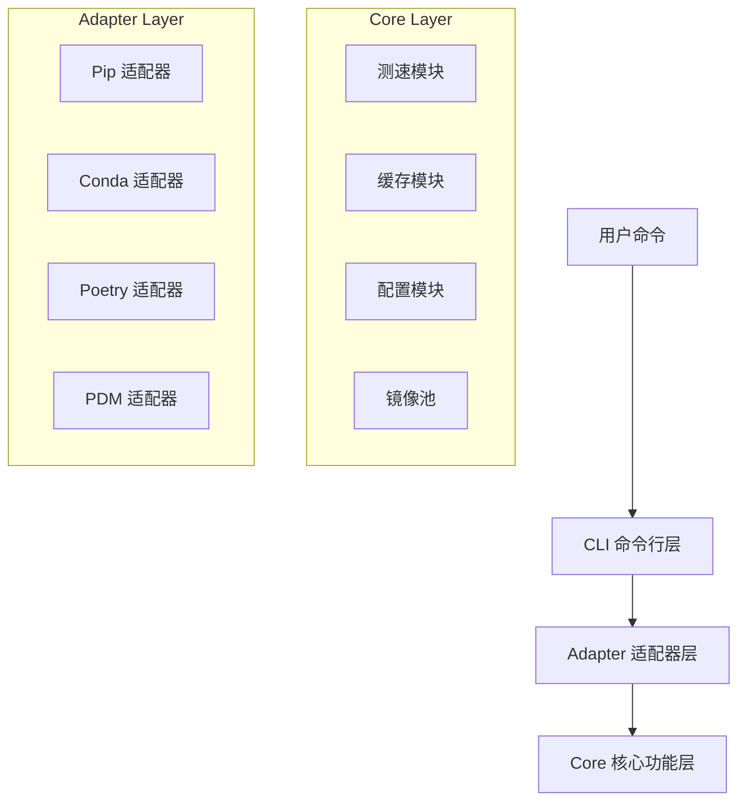

# yrb 架构设计文档

## 1. 系统概述

`yrb` 是一个基于 Python 的国内下载加速工具，旨在解决 pip、conda 等包管理器在国内网络环境下下载速度慢的问题。其核心设计理念是 **“零侵入、按需注入”**，即不修改用户的全局配置文件，而是通过环境变量在命令执行期间临时注入最优镜像源。

## 2. 架构分层

系统采用分层架构设计，主要分为三层：

### 2.1 CLI 命令行层 (`yrb.cli`)
- **职责**：负责解析用户输入的命令，分发到对应的适配器或内部功能模块。
- **技术栈**：基于 `click` 库实现。
- **主要文件**：
  - `cli.py`: 定义命令组和子命令（pip, conda, config 等）。
  - `exception_handler.py`: 全局异常捕获与友好提示。

### 2.2 Adapter 适配器层 (`yrb.adapter`)
- **职责**：针对不同的包管理器（pip, conda, poetry...）实现特定的镜像注入逻辑。
- **工作流程**：
  1. 接收 CLI 传递的参数。
  2. 调用 Core 层获取最优镜像。
  3. 构造特定的环境变量（如 `PIP_INDEX_URL`）。
  4. 启动子进程执行原始命令。
- **模块**：
  - `pip_adapter.py`: 处理 pip 命令，支持版本缓存。
  - `conda_adapter.py`: 处理 conda 命令。
  - `poetry_adapter.py`: 实验性支持 poetry。
  - `pdm_adapter.py`: 支持 pdm。

### 2.3 Core 核心功能层 (`yrb.core`)
- **职责**：提供通用的底层服务，不依赖具体包管理器。
- **模块**：
  - `speed_test.py`: 实现并发 HTTP HEAD 测速，支持缓存测速结果。
  - `config_manager.py`: 管理用户持久化配置（JSON），支持锁定镜像。
  - `cache_manager.py`: 管理本地包文件缓存，实现“下载一次，重复使用”。
  - `mirror_pool.py`: 维护内置的国内镜像源列表。

## 3. 核心流程

### 3.1 镜像优选流程
1. **检查配置锁定**：首先查询 `config_manager` 是否有用户锁定的镜像（如 `pip.mirror`）。
   - 若有锁定，直接返回该镜像，跳过测速。
2. **检查测速缓存**：若无锁定，检查 `speed_cache.json` 是否有有效期内的测速记录。
3. **并发测速**：若无缓存，使用 `ThreadPoolExecutor` 对镜像池进行并发 HEAD 请求测速。
4. **结果缓存**：将最优镜像写入缓存，有效期默认 1 小时。

### 3.2 命令执行流程
1. 用户输入 `yrb pip install numpy`。
2. `cli.py` 捕获命令，转发给 `pip_adapter.run_pip`。
3. `pip_adapter` 调用 `get_best_mirror` 获取镜像 URL。
4. 设置环境变量 `os.environ["PIP_INDEX_URL"] = url`。
5. 使用 `subprocess.run` 调用原生 `python -m pip install numpy`。

## 4. 数据存储

- **配置文件**：存储在用户配置目录（`platformdirs.user_config_dir`），格式为 JSON。
- **缓存文件**：存储在用户缓存目录（`platformdirs.user_cache_dir`），包含包缓存索引和测速缓存。
